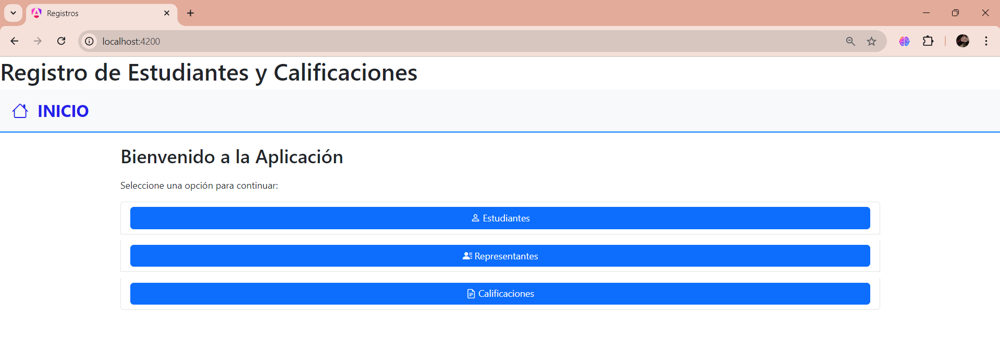
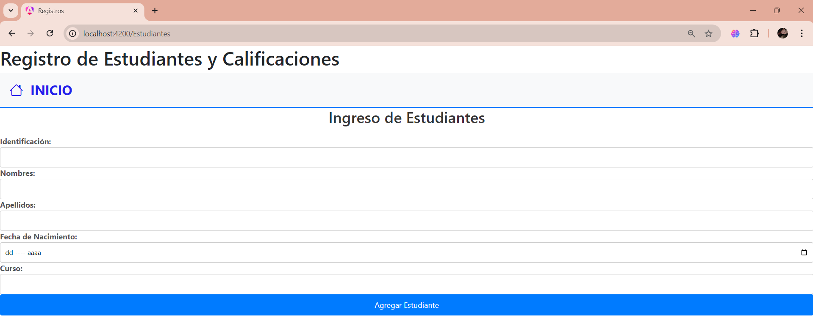
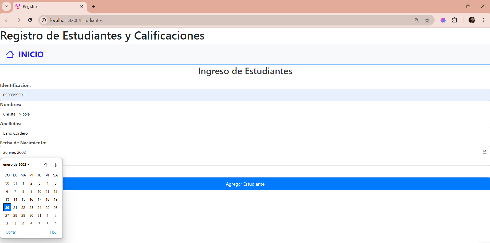
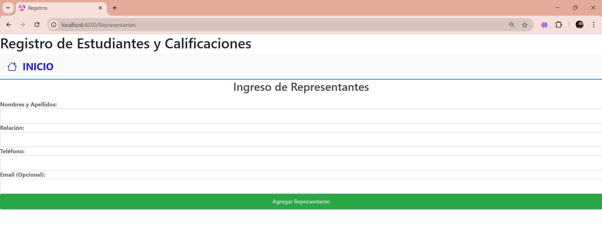
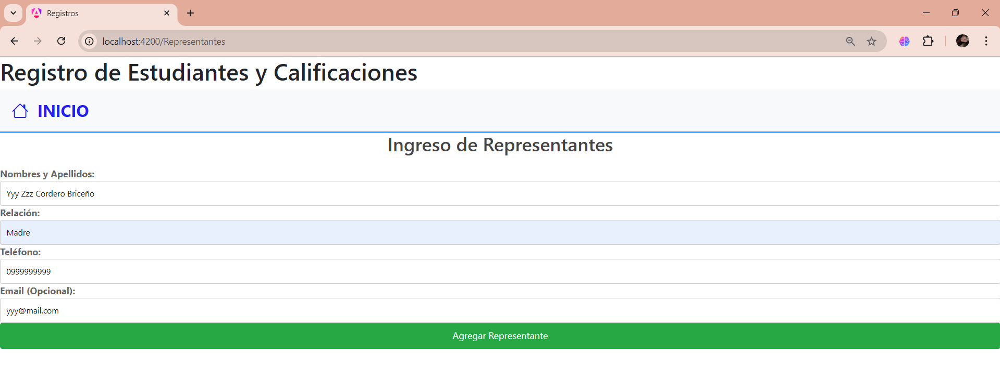
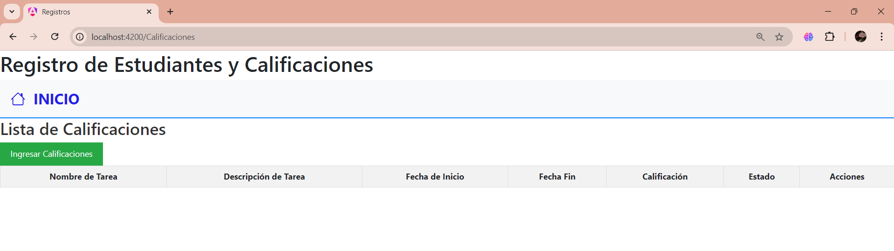
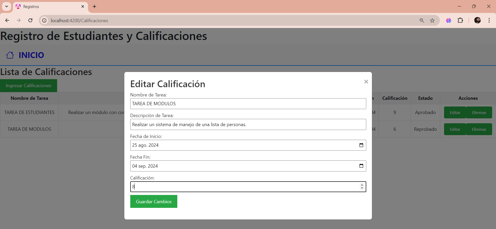
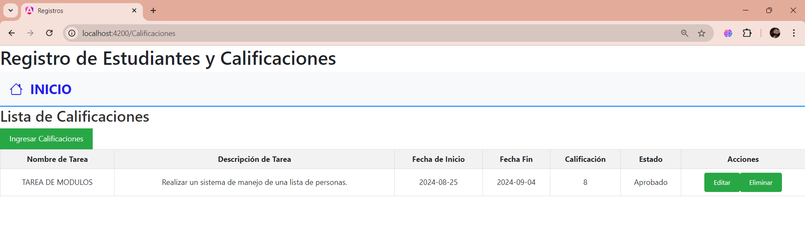

# Registros

This project was generated with [Angular CLI](https://github.com/angular/angular-cli) version 17.3.8.

## Development server

Run `ng serve` for a dev server. Navigate to `http://localhost:4200/`. The application will automatically reload if you change any of the source files.

## Code scaffolding

Run `ng generate component component-name` to generate a new component. You can also use `ng generate directive|pipe|service|class|guard|interface|enum|module`.

## Build

Run `ng build` to build the project. The build artifacts will be stored in the `dist/` directory.

## Running unit tests

Run `ng test` to execute the unit tests via [Karma](https://karma-runner.github.io).

## Running end-to-end tests

Run `ng e2e` to execute the end-to-end tests via a platform of your choice. To use this command, you need to first add a package that implements end-to-end testing capabilities.

## Further help

To get more help on the Angular CLI use `ng help` or go check out the [Angular CLI Overview and Command Reference](https://angular.io/cli) page.

# Proyecto de Calificaciones en Angular Realizado por Christell Baño

Este proyecto de Angular está diseñado para gestionar calificaciones de estudiantes y representantes. Incluye funcionalidades para agregar, visualizar, editar y eliminar calificaciones, así como para manejar datos de estudiantes y representantes.

## Página de Inicio

La página inicial sirve como un punto de acceso para navegar a las secciones principales del proyecto: Estudiantes, Representantes y Calificaciones.
La navegación está asegurada mediante enlaces que dirigen a las páginas de Estudiantes, Representantes y Calificaciones.
Y el enlace en el encabezado facilita el acceso rápido a la página inicial, nuevamente. 

## Funcionalidades

## Página de Registro Estudiante

### 1. Formulario de Registro

- **Descripción**: Permite a los usuarios registrar nuevos estudiantes ingresando sus datos personales.
- **Detalles**: El formulario requiere la entrada de los siguientes datos: Identificación, Nombres, Apellidos, Fecha de nacimiento y Curso.
- **Imagen**: 

## Página de Registro Representante

- **Descripción**: Permite a los usuarios registrar nuevos representantes ingresando sus datos.
- **Detalles**: El formulario requiere la entrada de los siguientes datos: Nombres y apellidos, Relación (Padre, Madre, Tío, etc.), Teléfono y Email (opcional).
- **Imagen**: 

## Página de Calificaciones

### 1. Visualización de Calificaciones

- **Descripción**: Muestra una tabla con las calificaciones ingresadas.
- **Detalles**: La tabla incluye columnas para el nombre de la tarea, descripción, fechas de inicio y fin, calificación, y el estado según la calificación ingresada ( =< 7 Aprobado/ > 7 Reprobado).
- **Imagen**: 

### 2. Ingreso de Calificaciones

- **Descripción**: Permite a los usuarios ingresar nuevas calificaciones a través de un modal.
- **Detalles**: El modal incluye un formulario para ingresar el nombre de la tarea, descripción, fechas, y calificación.
- **Imagen**: 

### 3. Edición y Eliminación

- **Descripción**: Cada fila de la tabla incluye botones para editar y eliminar calificaciones.
- **Detalles**: Los botones abren modales específicos para modificar los datos o eliminar las calificaciones existentes.
- **Imagen**: 

